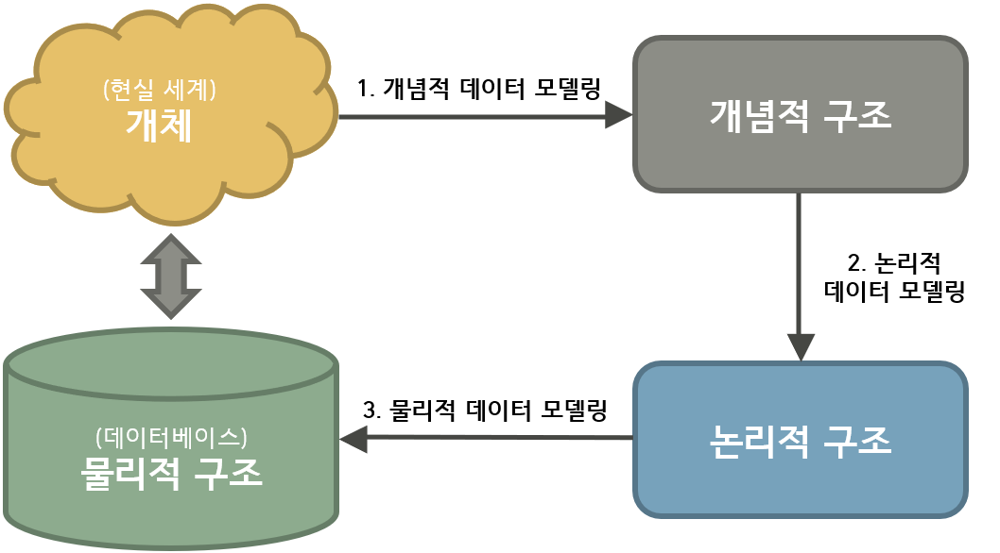

# Chapter 01. 데이터 모델링의 이해

## ⭐ Introduction

### 📌 Aims

* 데이터 처리에 있어 원천 저장소를 제공하는 데이터베이스의 설계 기법인 데이터 모델을 이해하고,엔티티ㆍ속성ㆍ관계ㆍ식별자에 대한 표현방법과 이것을 이용하여 표현하는 기술을 이해한다.
* 데이터 모델에 대한 기본적인 개념을 이해할 수 있도록 모델링의 세 가지 관점과 데이터 모델링의 세 가지 요소, 그에 다른 각각의 표기법에 대해 설명한다.
* 데이터 모델을 완성하는 측면에서 표기법을 기반으로 전개하여야 할 사항들에 대해 엔터티, 속성, 관계, 식별자 순으로 구성

 

### 📌 Summary

1. 데이터 모델의 이해

2. 엔터티

3. 속성

4. 관계

5. 식별자

 

## ⭐ Contents

### 📌 1. 데이터 모델의 이해

#### ✒ 모델링

- 정의: 현실세계의 문제를 **추상화**, **단순화**, **명확화**하기 위해 **일정한 표기법에 의해 표현하는 기법**
- 모델링의 관점
1. 데이터 관점(What, Data): 업무와 데이터가 어떤 관련인지, 데이터 간의 관계는 무엇인지
2. 프로세스 관점(How, Process): 실제하는 업무가 무엇인지, 무엇을 해야하는지
3. 상관관점(Interaction): 업무처리에 따라 데이터는 어떻게 처리되는지

 

#### ✒ 데이터 모델링

* 정의
1. 정보 시스템을 구축하기 위한 데이터 관점의 업무 분석 기법
2. 현실 세계의 데이터에 대해 약속된 표기법에 의해 표현하는 과정
3. 데이터베이스를 구축하기 위한 분석 및 설계의 과정

 

* 목적 및 기능
1. 시스템을 원하는 모습으로 가시화
2. 시스템의 구조와 행동을 명세화
3. 시스템을 구축하는 구조화한 틀 제공
4. 시스템 구축 과정에서 결정한 것을 문서화
5. 다양한 영역에 집중하기 위해 다른 영역의 세부 사항은 숨기는 관점을 제공
6. 특정 목표에 따라 구체화한 상세 수준의 표현 방법 제공

 

* 중요성
1. 파급효과(Leverage)
2. 복잡한 요구사항의 간결한 표현(Conciseness)
3. 데이터 품질(Data Quality)

 

* 유의점
1. 중복
2. 비유연성
3. 비일관성

 

#### ✒ 데이터 모델링의 3단계 진행

* 모델링의 표현

  

* 현실세계와 데이터베이스 사이의 모델

| 데이터 모델링           | 내용                                                         |
| ----------------------- | ------------------------------------------------------------ |
| 1. 개념적 데이터 모델링 | - 높은 추상화 수준, 업무 중심적, 포괄적인 수준의 모델링 진행 - EA 수립 단계시 많이 이용한다. - **핵심 업무**: ERD를 이용하여 핵심 엔터티와 그들간의 관계를 파악 및 표현  |
| 2. 논리적 데이터 모델링 | - 시스템의 구축하고자 하는 업무에 대해 Key, 속성, 관계 등을 명확히 표현 - 누가(Who), 어떻게(How) 데이터에 액세스하는지 전산화 - 비즈니스 데이터에 존재하는 사실들을 인식하여 기록하는 것 - **핵심 업무**: 정규화(Nomarlization) 진행 |
| 3. 물리적 데이터 모델링 | - 실질적으로 데이터 베이스에 이색할 수 있도록 성능, 저장 등 물리적인 성격을 고려한 설계 |

 

* 특징
1. 실질적으로 현실 프로젝트에서는 개념적/논리적 모델링을 분리하여 진행하는 경우는 드물다. 개념적/논리적 모델링을 합쳐 논리적 모델링으로 진행한다
2. 데이터 모델링은 사용자와 시스템 개발자가 데이터 요구 사항을 발견하는 것을 지원하며, 현 시스템이 어떻게 변형되어야 하는가를 이해하는 데 유용하다

 

#### ✒ 프로젝트 생명주기에 따른 데이터 모델링

| 생명주기   | 데이터베이스 변경           |
| ---------- | --------------------------- |
| 분석       | 개념적/논리적 데이터 모델링 |
| 설계       | 물리 데이터 모델링          |
| 개발       | DB 구축, 변경, 관리         |
| 테스트     | DB 튜닝                     |
| 전환ㆍ이행 | DB 전환                     |

 

#### ✒ 데이터 독립성

* 데이터베이스 내의 데이터, 데이터를 사용하는 사용자 및 응용 프로그램, 데이터베이스의 저장 구조가 서로 영향을 받지 않는 성질을 의미한다
* 데이터 독립성의 3가지 요소: 구조, 독립성, 사상(Mapping)
* ANSI/SPARC 3 Schema Architecture

| 항목                           | 내용                                                         |
| ------------------------------ | ------------------------------------------------------------ |
| 외부 스키마(External Schema)   | - 뷰 단계 여러 개의 사용자 관점으로 구성, 개개 사용자 단계로서 개개 사용자가 보는 개인적 DB 스키마 - DB의 개개 사용자나 응용 프로그래머가 접근하는 DB 정의 |
| 개념 스키마(Conceptual Schema) | - 모든 사용자 관점을 통합한 조직 전체의 DB를 기술하는 것 - DB에 저장되는 데이터와 그들 간의 관계를 표현하는 스키마 |
| 내부 스키마(Internal Schema)   | 물리적 장치에서 데이터가 실제적으로 저장되는 방법을 표현한 스키마 |

 

#### ✒ 데이터 모델링의 요소

* 엔터티(Entity): 업무가 관여하는 어떤 것(Things)
* 속성(Attribute): 어떤 것이 가지는 성질
* 관계(Relationships): 어던 것들 간의 관계

 

#### ✒ 데이터 모델링의 이해관계자

* DBA
* 현업 업무 전문가 (이해할 수 있는 수준만)
* 전문 모델러
* **프로젝트 개발자 (가장 중요)**

 

#### ✒ 데이터 모델링의 표기법

* 1976년 피터첸(Peter Chen)이 E-R모델(Entity-Relationship Model)이라는 표기법을 만듬.
* 현재는 **IE표기법**, 까마귀발 모양의 표기법(Crow's Foot)으로 알려진 IE 표기법을 가장 많이 사용함.

 

* ERD(Entity Relationship Diagram)은 각 업무 분석에서 도출된 엔터티와 엔터티간의 관계를 이해하기 쉽게 도식화된 다이어그램으로 표시하는 방법.

* ERD 작업 순서
1. 엔터티를 그린다
2. 엔터티를 적당히 배치
3. 관계 설정
4. 관계명 기술
5. 관계의 참여도 기술
6. 관계 필수여부를 기술

 

#### ✒ 좋은 데이터 모델의 요소

1. 완전성: 업무에 필요한 모든 데이터
2. 중복배제: 동일한 사실은 한번만
3. 업무 규칙: 해당 데이터 모델을 사용하는 모든 사용자(개발자, 관리자 등) 해당 규칙에 대해서 동일한 판단을 하고 데이터를 조작할 수 있도록 한다.
4. 데이터 재사용: 데이터의 통합성과 독립성에 충분히 고려, 새로운 업무환경의 변화에 의연히 대처
5. 의사소통: 데이터모델은 대상으로 하는 업무를 데이터 관점에서 분석하고 이를 설계하여 나오는 최종 산출물이다. 정보 시스템을 운영/관리하는 많은 관련자들이 설계자가 정의한 많은 업무 규칙들을 동일한 의미로 받아들이고 활용할 수 있게 하는 역할을 한다.
6. 통합성

### 📌 2. 엔터티

#### ✒ 정의

- **사전적 의미**에서의 엔터티란 "실체, 객체"를 의미
- **데이터베이스**에서는 업무에 필요하고 유용한 정보를 저장/관리하기 위한 집합적인 것

 

#### ✒ 엔터티의 특징

- 반드시 업무에 필요하고 관리하고자 하는 정보여야한다
- 유일한 식별자에 의해 식별이 가능해야한다.
- 영속적으로 존재하는 인스턴스의 집합(2개 이상)
- 엔터티는 실제 업무 프로세스에 의해 이용되야 한다.
- 엔터티는 반드시 속성이 있어야 한다.
- 엔터티는 최소 다른 엔터티와의 관계가 1개 이상 있어야한다. (예외. 통계 업무, 코드엔터티, 시스템 처리 내부데이터, 트랜잭션 로그 등)

 

#### ✒ 엔터티의 분류

* 엔터티는 자신의 성격에 의해 실체 유형에 따라 구분하거나 업무를 구성하는 모듭에 따라 구분이 되는 발생 시점에 의해 분류 될수 있다
* 유/무형
1. 유형 엔터티(Tangible Entity), 물리적인 형태가 있는 엔터티. ex) 사원, 물품
2. 개념 엔터티(Conceptual Entity), 물리적인 형태로는 존재하지 않지만 관리해야할 개념적 정보로 구분되는 엔터티. ex) 조직, 보험 상품
3. 사건 엔티티(Event Entity), 업무를 수행함에따라 발생하는 엔티티, 각종 통계 자료로 이용

 

* 발생시점
1. 기본 엔터티 (Fundamental): 그 업무에 원래 존재하는 정보. 독립적인 생성이 가능, 타 엔터티의 부모 역할 (= 다른 엔터티로부터 주식별자를 상속받지 X). ex) 사원, 고객, 부서, 상품, 등
2. 중심 엔터티 (Main Entity): 기본 엔터티로부터 발생되고 그 **업무에서 중심적인 역할**을 하게된다. 데이터의 양이 많이 발생하고 다른 덴터티와의 관계를 통해 많은 **행위 엔터티**를 생성한다. ex) 계약, 청구, 주문, 매출, 등
3. 행위 엔터티(Event Entity): 두개 이상의 부모엔터티로분터 발생하고, 자주 내용이 바뀌거나 데이터 양이 증가한다. 분석 초기 단계에서는 나타나지 않으며, 상세 설계 단계나 프로세스 상관모델링을 진행하면서 도출될 수 있다. ex) 주문 목록, 사원변경 이력

 

#### ✒ 엔터티의 명명 규칙

* 현업 업무에서 사용하는 용어여야한다.
* 가능하면 약어를 사용하지 않는다
* 단수 명사를 사용한다
* 유일한 이름을 부여해야 한다.

 

### 📌 3. 속성

#### ✒ 정의

* **사전적 의미**에서는 **"사물의 성질, 특징"**을 의미
* **데이터베이스**에서는 "업무에서 필요로 하는 인스턴스로 관리하고자 하는 의미상 더이상 분리할 수 없는 최소의 데이터 단위"를 의미

 

#### ✒  엔터티, 인스턴스와 속성의 관계

* 한개의 엔터티는 두개 이상의 인스턴스를 갖는다
* 한개의 엔터티는 두개 이상의 속성을 갖는다
* 한개의 속성은 한개의 값을 갖는다 (속성의 원자성)

 

#### ✒  속성의 분류

* 속성의 특성에 따른 분류
1. 기본 특성(Basic Attribute): 업무 분석을 통해 바로 정의, 가장 일반적이고 많은 속성을 차지
2. 설계 특성(Designed Attribute): 원래 업무 상 존재하지 않지만 설계하면서 도출해내는 속성. ex) 일련번호와 같은 단일(Unique)한 식별자를 부여하기 위해 모델에서 새로 정의하는 설계 속성
3. 파생 속성(Derived Attribute): 다른 속성으로 부터 계산,변형,생성되는 속성을 의미. 데이터 정합성을 유지하기 위해 유의할점이 많으니, 가급적 적게 정의하는 것이 좋다.

 

* 엔터티 구성방식에 따른 분류
1. PK(Primary Key): 엔터티를 식별할 수 있는 속성
2. FK(Foreign Key): 다른 엔터티와의 관계에서 포함된 속성
3. 일반 속성: 엔터티에 포함되어 있고 PK/FK에 포함되지 않은 속성

 

#### ✒ 도메인

* 각 속성이 가질 수 있는 값의 범위
* 엔터티 내에서 속성에 대한 데이터 타입과 크기/제약사항을 지정하는 것

 

#### ✒ 속성의 명명

* 속성 이름을 정확하게 부여하고 용어의 혼란을 없애기 위해 용어사전이라는 업무사전을 프로젝트에서 이용한다.

 

### 📌 4. 관계

#### ✒ 정의

* **사전적 의미**에서는 "상호 연관성이 있는 상태"
* **데이터베이스**에서는 "인스턴스 사이의 논리적 연관성으로서 존재의 형태로서나 행위로서 서로에게 연관성이 부여된 상태"

 

#### ✒ 관계의 분류

* 존재에 의한 관계. ex) 부서 - 사원; 소속된다
* 행위에 의한 관계. ex) 고객 - 상품; 주문한다

 

#### ✒ 관계의 표기법

* 관계명(Membership): 관계 이름
* 관계 차수(Cardinality): 1:1, 1:M, N:M
* 관계 선택사양(Optionality): 필수관계, 선택관계

 

### 📌 5. 식별자

#### ✒ 정의

* 식별자(Identifier)란 인스턴스를 구분할 수 있는 논리적인 이름

 

#### ✒ 식별자의 특징

1. 유일성, 모든 인스턴스가 유일하게 구분
2. 최소성, 주식별자를 구성하는 속성수는 유일성을 만족해야함
3. 불변성, 자주 변하지 않는 것
4. 존재성, 반드시 값이 있어야 함.

 

#### ✒ 식별자의 분류

| 분류        | 식별자     | 설명                                                         |
| ----------- | ---------- | ------------------------------------------------------------ |
| 대표성 여부 | 주식별자   | 엔터티 내에서 각 어커런스를 구분할 수 있는 구분자이며, 타 엔터티와 참조관계를 연결할 수 있는 식별자 |
| 대표성 여부 | 보조식별자 | 엔터티 내에서 각 어커런슥를 구분할 수 있는 구분자이나, 대표성을 가지지 못해 참조관계 연결을 못함 |
| 독립성      | 내부식별자 | 엔터티 내부에서 스스로 만들어지는 식별자                     |
| 독립성      | 외부식별자 | 타 엔터티와의 관계를 통해 타 엔터티로 부터 받아오는 식별자   |
| 속성 수     | 단일식별자 | 하나의 속성으로 구성된 식별자                                |
| 속성 수     | 복합식별자 | 둘 이상의 속성으로 구성된 식별자                             |
| 대체 유무   | 본질식별자 | 업무에 의해 만들어지는 식별자                                |
| 대체 유무   | 인조식별자 | 업무적으로 만들어지지는 않지만 원조식별자가 복잡한 구성을 갖고 있기 때문에 인위적으로 만든 식별자 |

 

#### ✒ 주식별자 도출기준

* 해당 업무에서 자주 이용되는 속성을 주식별자로 지정
* 명칭, 내역 등과 같이 이름으로 기술 되는 것들은 가능하면 주식별자로 지정하지 않는다
* 복합으로 주식별자를 구성할 경우 너무 많은 속성(일반적으로 7-8개 이상)이 포함되지 않도록 한다 => 새로운 인조식별자 생성

 

#### ✒ 식별자 관계와 비식별자 관계에 따른 식별자

| 항목               | 식별자 관계                                                  | 비식별자 관계                                                |
| ------------------ | ------------------------------------------------------------ | ------------------------------------------------------------ |
| 목적               | 강한 연결관계 표현                                           | 약한 연결관계 표현                                           |
| 자식 주식별자 영향 | 자식 주식별자의 구성에 포함됨                                | 자식 일반속성에 포함됨                                       |
| 표기법             | 실선 표현                                                    | 점선 표현                                                    |
| 연결 고려사항 | - 반드시 부모엔터티 종속 - 자식 주식별자 구성에 부모 주식별자 포함 필요 - 상속받은 주식별자 속성을 타 엔터티에 이전 필요 | - 약한 종속관계 - 자식 주식별자 구성을 독립적으로 구성 - 자식 주식별자 구성에 부모 주식별자 부분 필요 - 상속받은 주식별자 속성을 타엔터티에 차단 필요 - 부모 쪽의 관계 참여가 선택관계 |

